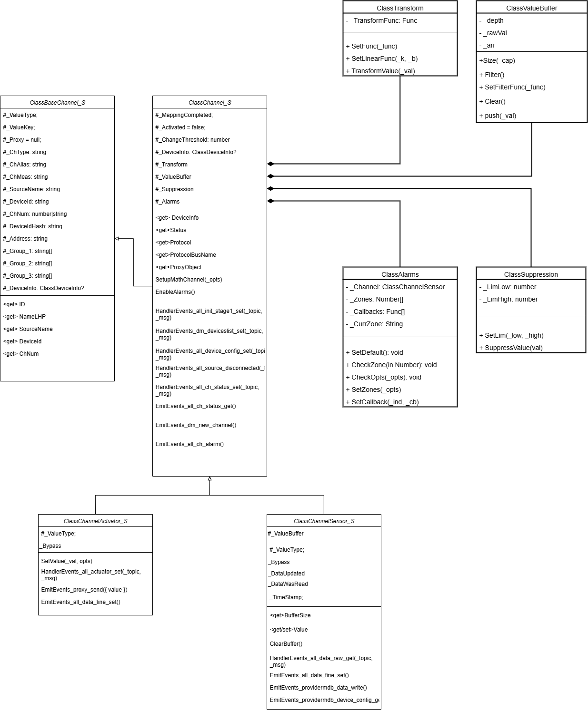

<div style="font-family: 'Open Sans', sans-serif; font-size: 16px">

# srvChannel
<div style="color: #555">
    <p align="center">
    
    </p>
</div>

## Лицензия
////

### Описание
<div style="color: #555">

**ClassBaseChannel_S** — это класс, представляющий каждый отдельно взятый канал сенсора или актуатора в качестве службы фреймворка. Он определяет основную структуру службы-канала: сохраняет обязательные конфигурационные свойства и геттеры, через которые классам-наследникам обеспечивается доступ к ним. 

<div style="color: #555">
<p align="center">

</p>
</div>

### Конструктор
<div style="color: #555">

- _busList - массив шины;
- _busNameList - список имен шин;
- _advOpts - объект, содержащий настройки канала (имя источника, идентификатор устройства и номер канала).

</div>

### Поля
<div style="color: #555">

- #_ValueType - тип данных, принимаемых каналом;
- #_ValueKey - имя ключа по которому принимаются данные или команда, если они поступили в виде JSON-строки;
- #_ChType - тип, 'actuator' | 'sensor';
- #_ChAlias - второе имя канала; 
- #_ChMeas - единица измерения;
- #_SourceName — идентификатор источника;
- #_ChNum — номер канала (начиная с 0);
- #_DeviceId — идентификатор устройства;
- #_DeviceIdHash - уникальный хэш, идентифицирующий модель актуатора;
- #_Address - топик, ассоциированный с каналом;
- #_Group_1, #_Group_2, #_Group_3 - списки групп/тэгов для группировки каналов; например, 
    ```{
        Name: 'lampHK1',
        Type: 'actuator',
        Groups_1: ['my_home', 'kitchen']
        Groups_2: ['light']
        Groups_3: ['evening']
    }
    ```

</div>

### Аксессоры

<div style="color: #555">

- get ID — возвращает уникальный идентификатор канала, сформированный хешем от имени канала;
- get NameLHP — возвращает идентификатор канала в формате `<deviceId>-<chNum>`, используемый в протоколе `ws/lhp`;
- get SourceName — возвращает имя источника (например, брокера), с которым связан канал;
- get DeviceId — возвращает идентификатор устройства, к которому относится канал;
- get DeviceIdHash — возвращает хеш-идентификатор устройства;
- get ChNum — возвращает номер или идентификатор канала в контексте устройства;
- get ChAlias — возвращает псевдоним (alias) канала;
- get ChMeas — возвращает строковое обозначение единицы измерения показаний канала (например, "°C", "%", "В");
- get ChType — возвращает строковой тип канала: `"сенсор"` или `"актуатор"`;
- get ValueType — возвращает тип значения, передаваемого по каналу: `number` или `string`;
- get ValueKey — возвращает имя ключа, по которому поступают данные от источника;
- get Address — возвращает адрес канала в системе передачи данных (например, MQTT-топик или Modbus-адрес);
- get Group_1, `get Group_2`, `get Group_3` — возвращают значения групповой принадлежности канала, применяемые для логической классификации;
- get Status — возвращает `"active"` или `"inactive"` в зависимости от текущего состояния маппинга и доступности источника.

<div style="color: #555">

**ClassChannel_S** — это класс, представляющий каждый отдельно взятый канал сенсора или актуатора в качестве службы фреймворка. Он определяет основную структуру службы-канала: сохраняет обязательные конфигурационные свойства и геттеры, через которые классам-наследникам обеспечивается доступ к ним. 

### Конструктор
- _busList - массив шины;
- _busNameList - список имен шин;
- _advOpts - объект, содержащий настройки канала (имя источника, идентификатор устройства и номер канала).

### Поля
- #_MappingCompleted — выполнено ли сопоставление канала с активным источником;
- #_Activated — источник подтвердил наличие канала сообщением `dm-deviceslist-set`;
- #_ChangeThreshold — порог изменения для значений канала;
- #_DeviceInfo — информация о физическом датчике;
- #_Transform — настройки преобразования данных;
- #_Suppression — настройки подавления данных;
- #_Filter — фильтр для значений канала;
- #_Alarms — объект для работы с тревогами;
- #_Proxy — прокси-обертка для предосталвения пользователю.

### Аксессоры
- get Status — возвращает статус канала: "active" если источник подключён и канал сопоставлен, иначе "inactive";
- get Protocol — возвращает строковое обозначение протокола (например, "mqtt", "ws") источника, к которому привязан канал;
- get ProtocolBusName — возвращает имя шины, через которую осуществляется взаимодействие с прокси-службой, связанной с данным протоколом;
- get Group_1, get Group_2, get Group_3 — возвращают значения групповой принадлежности канала, применяемые для логической классификации;
- get ProxyObject — возвращает прокси-объект с ограниченным внешним доступом (блокируются внутренние методы типа EmitEvent_/HandlerEvents_).

### Подписки
sysBus:
- 'all-init-stage1-set' - этап инициализации системы;

dataBus:
- 'all-ch-status-set' - команда на активацию/деактивацию канала;
```js
{
    com: 'all-ch-status-set',
    arg: [ch_name],
    value: [status]     //'active'/'inactive'
}
```

### События
sysBus:
- 'dm-new-channel' - сообщение об инициализации:
```js
{
    com: 'dm-new-channel',
    arg: [ch_name],
    value: [this]   // ссылка на объект канала
}
```
dataBus:
- 'all-ch-status-get' - сообщение с актуальным статусом канала;
```js
{
    com: 'all-ch-status-get',
    arg: [ch_name],
    value: [ch_status]  // 'active'/'inactive'
}
```
- 'all-ch-alarm' — сообщение об изменении ткущей зоны измерения канала; транслируется на `dataBus`. 
Сокращенный формат сообщения: 
```js
{
    com: 'all-ch-alarm',
    arg: ['source1_name-00-01'],
    value: [ { redLow: 0, yelLow: 0, green: 0, yelHigh: 1, redHigh: 0 } ]
}
```

### Методы

* SetupMathChannel — конфигурирует обработку данных на канале в соответствии с переданными параметрами (`ChConfigOpts`);
* HandlerEvents\_dm\_deviceslist\_set — обрабатывает список каналов, полученный от PLC или прокси-службы источника;
* HandlerEvents\_all\_device\_config\_set — обрабатывает получение конфигурации устройств с шины данных;
* HandlerEvents\_all\_source\_disconnected — при отключении источника проверяет, относится ли к нему текущий канал, и отправляет сообщение о деактивации, если да;
* HandlerEvents\_all\_ch\_status\_set — обрабатывает событие установки статуса канала (обычно после внешнего воздействия);
* EmitEvents\_all\_ch\_status\_get — отправляет сообщение о текущем статусе канала (active/inactive) в шину `dataBus`;
* EmitEvents\_providermdb\_device\_config\_get — отправляет запрос на получение конфигурации устройства в шину `mdbBus`;
* EmitEvents\_dm\_new\_channel — уведомляет о создании нового канала, отправляя сообщение в системную шину `sysBus`;
* EmitEvents\_all\_ch\_alarm — отправляет сообщение с текущими состояниями зон тревог канала (реализация не представлена);
* EnableAlarms — инициализирует объект тревог (`ClassAlarms`) в полях текущего канала.

### Пример использования
```js

```

</div>

</div>